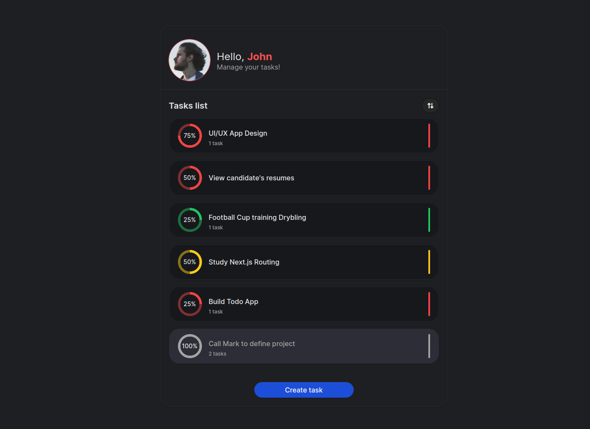
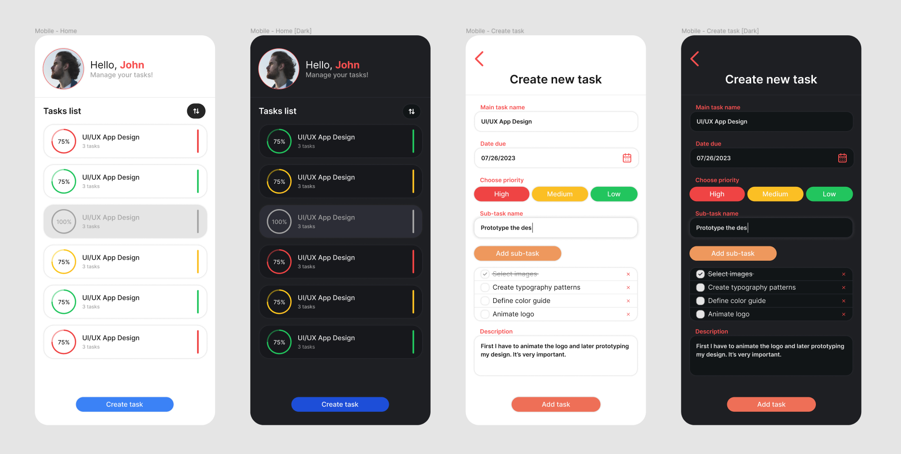

<h1 align="center">SuperTask</h1>

A task management app created during a test code.

  <a href="#-the-challenge">The challenge</a>&nbsp;&nbsp;&nbsp;|&nbsp;&nbsp;&nbsp;
  <a href="#%EF%B8%8F-tools">Tools</a>&nbsp;&nbsp;&nbsp;|&nbsp;&nbsp;&nbsp;
  <a href="#-project">Project</a>&nbsp;&nbsp;&nbsp;|&nbsp;&nbsp;&nbsp;
  <a href="#-deploy">Deploy</a>

  <a href="#%EF%B8%8F-i-learned">Learned</a>&nbsp;&nbsp;&nbsp;|&nbsp;&nbsp;&nbsp;
  <a href="#-continued-development">Continued development</a>&nbsp;&nbsp;&nbsp;|&nbsp;&nbsp;&nbsp;
  <a href="#%EF%B8%8F-author">Author</a>

  

 

  

## 🏆 The challenge
The challenge was to develop a task management app for a busy professional that struggles to stay organized. The app must be user-friendly, have a visual appealing interface and the interface should addapt to different screen sizes and devices.

Users should be able to:

- Display Task List
- Add New Task
- Add Subtask
- Mark Task as Completed
- Delete Task
- Order Tasks

 

## 🛠️ Tools

This project was built using following tools:

- React
- Next.js
- TypeScript
- Tailwind
- Tailwind-variants
- React Hook Form
- Figma

 

## 💻 Project

### Figma design
A figma project was created to define the app design with project colors, typography, spacing, components and wireframes. The Figma project can be accessed through this [link](https://www.figma.com/file/vpm63osa51ZYTsKe3DTWGq/SuperTask?type=design&node-id=9%3A56&mode=design&t=uvf7PkgPu7YUGUhX-1) (you'll need a Figma account).

#### Project demonstration
https://github.com/tascintra/supertask/assets/107153161/1b230722-0925-468e-aeac-793f396a50c6

### Tailwind
UI components were created using Tailwind and tailwind-variants which is a lib to help building variants (like is was introduced with Stitches and Emotion) for components to provide code and style reusability. The project also has Dark Mode which was implemented with Tailwind Dark Mode API and is configured to use the user's system configured theme to choose the app theme.

### Next.js
The project backend was build using Next new API Routes with app folder structure. For the front-end the Routes, Dynamic Routes, Linking and Navigation features were used.

 

## 🌎 Deploy
Online app version: [supertask.vercel.app](https://supertask.vercel.app/)

 

## 👨‍💻 Continued development

I have plans to improve this project, since the better code organization and structure to adding new features as creating and linkig it with a database and manage integration with Prisma and validations with Zod. Develop user management and login function are ideas for the near future. Creating and configuring a Storybook to document components behavior and usability and much more.

 

## ✅ I learned

In this project my main learning was how to build an API with the new Next.js API Routes using the new app folder structure.

 

## 🦸🏾‍♂️ Author

- LinkedIn: [linkedin.com/in/tascintra](https://www.linkedin.com/in/tascintra/)
- Frontend Mentor: [frontendmentor.io/profile/tascintra](https://www.frontendmentor.io/profile/tascintra)

---

#### :memo: License

This project is under a MIT license.
